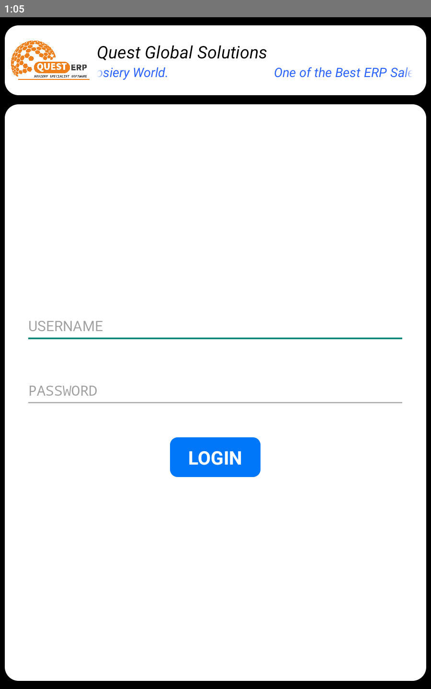
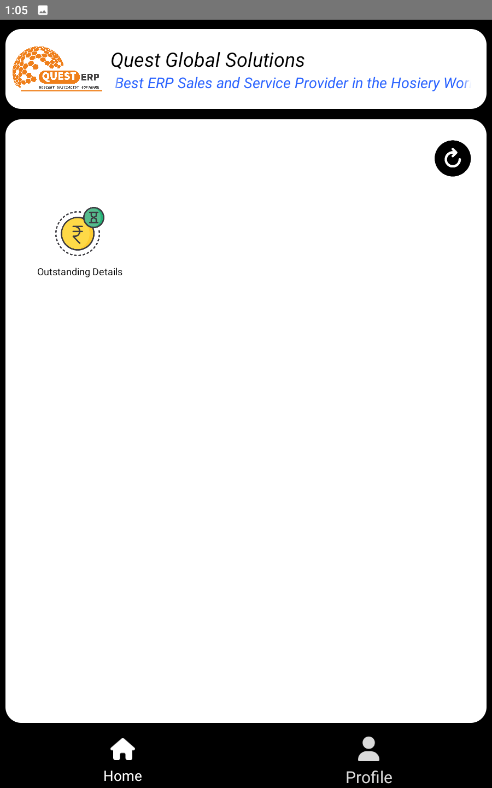
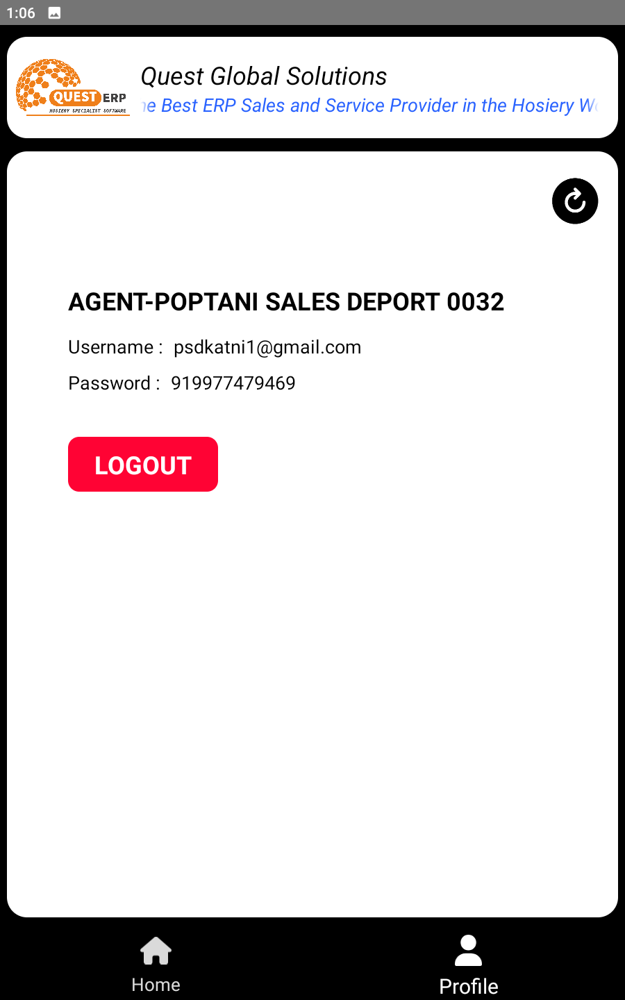

# Quest Global Solutions

This is a Android app to display user data from [Quest Global Solutions API](https://github.com/QuestGlobalSolutions/api)

## Features

- Display user data in a RecyclerView
- User can login to the app and see the data
- User can logout from the app

## Requirements

- Android 24 or higher
- Internet connection

## Tech Stack

- **Programming Language**: Kotlin
- **IDE**: Android Studio
- **Architecture**: MVVM (Model-View-ViewModel)
- **Networking**: Retrofit
- **Dependency Injection**: Dagger-Hilt
- **UI Components**: RecyclerView, ViewModel, LiveData
- **Database**: Room
- **Testing**: JUnit, Espresso

## Installation

- Clone the repository
- Open the project in Android Studio
- Run the app on an emulator or a physical device

- You can also install the apk directly from here [Quert Erp](Screenshot/Quest%20ERP%20176.apk)

## Configuration

- The API endpoint is configured in the `ApiInterface.kt` file
- The API key is configured in the `strings.xml` file

## Screenshots

